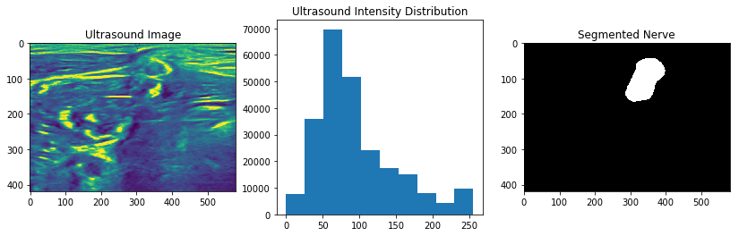
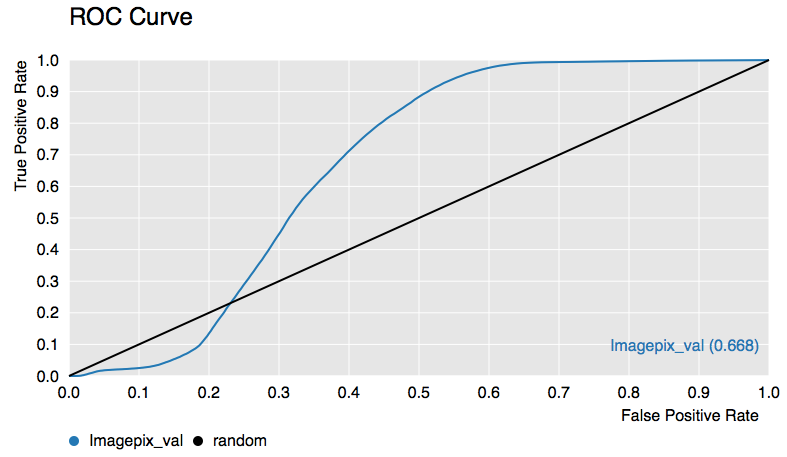
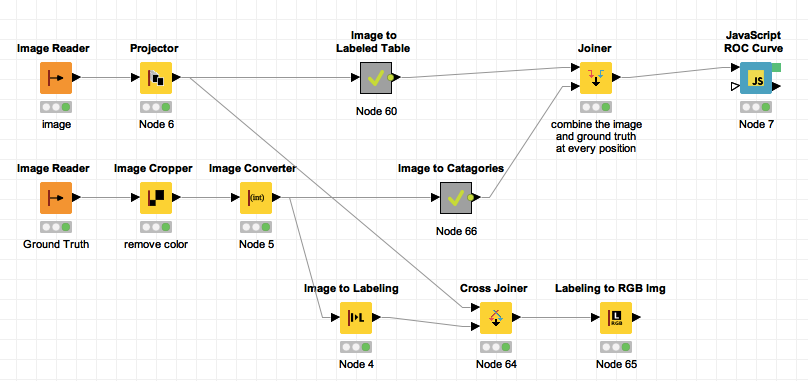

## Downloading the data
1. The data for the example can be downloaded from [here](https://www.kaggle.com/c/ultrasound-nerve-segmentation/data) and extract the train.zip file

2. Open the file in Archive Manager and extract the data to ```/scratch``` (only on D61.1 machines)

3. For each .tif file there is an associated _mask.tif corresponding to the ground truth

Many of these workflows are fairly complicated and would be time consuming to reproduce, follow the instructions [here](https://github.com/kmader/Quantitative-Big-Imaging-2016/wiki/KNIME-Setup#loading-workflows) for how to import a workflow from the zip files on this site


## Problems!
If you load a workflow and get an error message, click on the details button. If it says 'Node ... not available' it means you need to update your 'Image Processing Extensions' follow the instructions below to perform this update: [instructions](https://github.com/kmader/Quantitative-Big-Imaging-2016/wiki/KNIME-Setup#updating-to-the-latest-image-processing-extensions)

- If you cannot find the 'Salt and Pepper' node, this also means you are not using the latest Image Processing Extensions so update it as described above

## Getting Started

- Steps are shown in normal text, comments are shown in _italics_.

- Knime Basics: [here](https://github.com/kmader/Quantitative-Big-Imaging-2016/wiki/KNIME-Setup)

- Use workflow variables: [here](https://github.com/kmader/Quantitative-Big-Imaging-2016/wiki/KNIME-Setup#workflow-variables)

## Exploring ROC Curves

The task from the lecture of identifying the nerve in the ultrasound image
 . 

We thus have these data loaded in the workflow as the image and ground truth respectively.



The ROC curve's discussed in the last lecture we will use as a tool for evaluating our accuracy for the rest of the course. An example work-flow is below to generate the above curve.



Download the workflows [here](https://github.com/kmader/Quantitative-Big-Imaging-2016/blob/master/Exercises/04-files/ROCCurveSimple.zip?raw=true)

### Tasks
1. Where does filtering come into this workflow? 
 - Which filter elements might improve the area under the ROC?
 - Try making workflows to test out a few different filters
2. Where might morphological operations fit in?
 - How can you make them part of this workflow as well?
3. (Challenge) Use the ```Parameter Optimization Loop Start``` node to find the best filter size to maximize the ROC area

