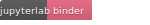

## Quantitative Big Imaging Course 2018

Here are the lectures, exercises, and additional course materials corresponding to the spring semester 2016 course at ETH Zurich, [227-0966-00L](http://www.vvz.ethz.ch/Vorlesungsverzeichnis/lerneinheitPre.do?lerneinheitId=113382&semkez=2017S&lang=en): Quantitative Big Imaging.

The lectures have been prepared and given by Kevin Mader and associated guest lecturers. Please note the Lecture Slides and PDF do not contain source code, this is only available in the handout file. Some of the lectures will be recorded and placed on YouTube on the [QBI Playlist](https://www.youtube.com/playlist?list=PLTWuXgjdOrnnHVDj_xgpUfbnlPmvW_33M).

# Slack

For communicating, discussions, asking questions, and everything, we will be trying out Slack this year. You can sign up under the following [link](https://qbi2018.slack.com/shared_invite/MTQ1NDY1OTc1NDYzLTE0ODc3NTE3NDktMDBkOWQwZGUzZg). It isn't mandatory, but it seems to be an effective way to engage collaboratively [How scientists use slack](http://www.nature.com/news/how-scientists-use-slack-1.21228)

# Lectures
### 22th February - Introduction and Workflows
 - [Slides (static)](http://nbviewer.jupyter.org/format/slides/github/kmader/Quantitative-Big-Imaging-2018/blob/master/Lectures/01-Introduction.ipynb)
 - [Interactive Lecture Slides (Binder / beta)](http://mybinder.org/v2/gh/kmader/quantitative-big-imaging-2018/master?filepath=Lectures/01-Introduction.ipynb)
 - [Lecture Handout](http://nbviewer.jupyter.org/github/kmader/Quantitative-Big-Imaging-2018/blob/master/Lectures/01-Introduction.ipynb)
 - [Lecture Video](https://www.youtube.com/watch?v=-rMot6mbdN8&t=0s&index=1&list=PLTWuXgjdOrnnHVDj_xgpUfbnlPmvW_33M)
 - [2017 Lecture Slides](https://rawgithub.com/kmader/Quantitative-Big-Imaging-2017/master/Lectures/01-Slides.html)

### 1rd March - Image Enhancement (A. Kaestner)
 - [Lecture Slides](https://rawgithub.com/kmader/Quantitative-Big-Imaging-2016/master/Lectures/02-Slides-ImageEnhancement.pdf)
 - Old Lecture Video: [Part 1](https://youtu.be/0Wrvjg8vbPg), [Part 2](https://youtu.be/Q6C1rO9x4PA)

### 9rd March - Tutorial: Python, Notebooks and Scikit
 - Lecture [slides](https://rawgithub.com/kmader/Quantitative-Big-Imaging-2017/master/Lectures/03-QBI-PythonTutorial.slides.html)
 - [Handout](https://github.com/kmader/Quantitative-Big-Imaging-2017/blob/master/Exercises/03-QBI-PythonTutorial.ipynb)

### 16th March - Basic Segmentation, Discrete Binary Structures
 - [Lecture Slides](https://rawgithub.com/kmader/Quantitative-Big-Imaging-2017/master/Lectures/03-Slides.html)
 - [Old Lecture Handout](https://rawgithub.com/kmader/Quantitative-Big-Imaging-2016/master/Lectures/03-Handout.html) as [PDF](https://rawgithub.com/kmader/Quantitative-Big-Imaging-2015/master/Lectures/03-Handout.pdf)
 - Lecture Video: [Part 1](https://youtu.be/EL_ZiVhqtx8), [Part 2](https://youtu.be/7bdydJeCUoE)

### 23rd March - Advanced Segmentation
 - [Lecture Slides](https://rawgithub.com/kmader/Quantitative-Big-Imaging-2017/master/Lectures/04-Slides.html)
 - [Old Lecture Handout](https://rawgithub.com/kmader/Quantitative-Big-Imaging-2016/master/Lectures/04-Slides_files/04-Handout.html) as [Old PDF](https://rawgithub.com/kmader/Quantitative-Big-Imaging-2015/master/Lectures/04-Handout.pdf)
 - Lecture Video: [Part 1](https://www.youtube.com/watch?v=2o8swi_vei8), [Part 2](https://www.youtube.com/watch?v=wN1kNxIVw9I)

### 30th March - Analyzing Single Objects
 - [Lecture Slides](https://rawgithub.com/kmader/Quantitative-Big-Imaging-2017/master/Lectures/05-Slides.html)
 - [Old Lecture Handout](https://rawgithub.com/kmader/Quantitative-Big-Imaging-2016/master/Lectures/05-Slides_files/05-handout.html) as [Old PDF](https://rawgithub.com/kmader/Quantitative-Big-Imaging-2015/master/Lectures/06-Handout.pdf)
 - Lecture Video: [Part 1](https://youtu.be/-uMJNOcUGVY), [Part 2](https://youtu.be/VoiYCE3XQgw)

### 6th April - Analyzing Complex Objects
 - [Lecture Slides](https://rawgithub.com/kmader/Quantitative-Big-Imaging-2017/master/Lectures/06-Slides.html)
 - [Old Lecture Handout](https://rawgithub.com/kmader/Quantitative-Big-Imaging-2016/master/Lectures/06-Slides_files/06-handout.html)
 - Lecture Video: [Part 1](https://youtu.be/GXg61CZx6Yc), [Part 2](https://youtu.be/8F4ClTTXI2w)

### 13th April - Many Objects and Distributions
 - [Lecture Slides](https://rawgithub.com/kmader/Quantitative-Big-Imaging-2017/master/Lectures/07-Slides.html)
 - [Old Lecture Handout](https://rawgithub.com/kmader/Quantitative-Big-Imaging-2016/master/Lectures/07-Slides_files/07-handout.html) as [PDF](https://rawgithub.com/kmader/Quantitative-Big-Imaging-2015/master/Lectures/08-Handout.pdf)
 - Lecture Video: [Part 1](https://youtu.be/hkHdpQTlGio), [Part 2](https://youtu.be/UvOPxdKZ3NI)

### 27st April - Statistics, Prediction, and Reproducibility
 - [Lecture Slides](https://rawgithub.com/kmader/Quantitative-Big-Imaging-2017/master/Lectures/08-Slides.html)
 - [Lecture Handout](https://rawgithub.com/kmader/Quantitative-Big-Imaging-2017/master/Lectures/08-Slides_files/08-handout.html) as [old PDF](https://rawgithub.com/kmader/Quantitative-Big-Imaging-2015/master/Lectures/09-Handout.pdf)
 - Lecture Video: [Part 1](https://youtu.be/UUa9zJtbuW4), [Part 2](https://youtu.be/nYz3_GERV6Q), [Part 3](https://youtu.be/yqWToMDc7u4)

### 4th May - Dynamic Experiments
 - [Lecture Slides](https://rawgithub.com/kmader/Quantitative-Big-Imaging-2017/master/Lectures/09-Slides.html)
 - [Old Old Lecture Handout](https://rawgithub.com/kmader/Quantitative-Big-Imaging-2015/master/Lectures/10-handout.html) as [PDF](https://rawgithub.com/kmader/Quantitative-Big-Imaging-2015/master/Lectures/10-handout.pdf)
 - Lecture Video: [Part 1](https://youtu.be/77kmZjiKQYQ)

### 11th May - Scaling Up / Big Data
 - [Lecture Slides](https://rawgithub.com/kmader/Quantitative-Big-Imaging-2017/master/Lectures/10-Slides.html)
 - [Old Lecture Handout](https://rawgithub.com/kmader/Quantitative-Big-Imaging-2015/master/Lectures/11-handout.html) as [PDF](https://rawgithub.com/kmader/Quantitative-Big-Imaging-2016/master/Lectures/10-handout.pdf)
 - Lecture Video: [Part 1](https://www.youtube.com/watch?v=DReSAalWzq0&index=19&list=PLTWuXgjdOrnnBtf554bMfKV6n2S6XgcLv) and [Part 2](https://www.youtube.com/watch?v=QNOCCrQZa_E&index=20&list=PLTWuXgjdOrnnBtf554bMfKV6n2S6XgcLv)

### 18th May  - Guest Lecture - High Content Screening (M. Prummer) / Project Presentations

 - [High Content Screening Slides](https://rawgithub.com/kmader/Quantitative-Big-Imaging-2016/master/Lectures/11-HCSSlides.pdf) - Michael Prummer / Nexus / Roche

### 1st June - Guest Lecture - Big Aerial Images with Deep Learning and More Advanced Approaches (J. Montoya)
### Old Guest Lectures

 - [Roads from Aerial Images Slides ](https://rawgithub.com/kmader/Quantitative-Big-Imaging-2016/master/Lectures/11-AerialSlides.pdf) - Javier Montoya / Computer Vision / ScopeM
 - [Deep Learning Slides (A. Lucchi)](https://rawgithub.com/kmader/Quantitative-Big-Imaging-2016/master/Lectures/12-DeepLearning.pdf)

# Exercises
## General Information
The exercises are based on the lectures and take place in the same room after the lecture completes. The exercises are designed to offer a tiered level of understanding based on the background of the student. We will (for most lectures) take advantage of an open-source tool called KNIME (www.knime.org), with example workflows here (https://www.knime.org/example-workflows).  The basic exercises will require adding blocks in a workflow and adjusting parameters, while more advanced students will be able to write their own snippets, blocks or plugins to accomplish more complex tasks easily.
The exercises from last year (available on: kmader.github.io/Quantitative-Big-Imaging-2015/) are done entirely in ImageJ and Matlab for students who would prefer to stay in those environments (not recommended)

## Assistance
The exercises will be supported by Amogha Pandeshwar and Kevin Mader. There will be office hours in ETZ H75 on Thursdays between 14-15 or by appointment.

## Online Tools
The exercises will be available on Kaggle as 'Datasets' and we will be using binder as stated above. For those interested there will be an option to use [Github Classroom](https://classroom.github.com/classrooms/36815273-quantitative-big-imaging) to turn in assignments (make sure your @student.ethz.ch address is linked to your github account)

## Specific Assignments

### 22rd February - Introduction and Workflows
 - [Getting Started with KNIME](Exercises/01-Description.md)

### 1st March - Image Enhancement (A. Kaestner)
  - For all exercises it is important to take the starting data
  - [Starting Data](https://github.com/kmader/Quantitative-Big-Imaging-Course/blob/master/Ex2/matlab.zip?raw=true)

#### KNIME
 - The KNIME or workflow based exercises are here
 - [KNIME Exercises](https://github.com/kmader/Quantitative-Big-Imaging-2017/blob/master/Exercises/02-Description.md)

#### Kaggle (Python)
 - You can get started on Kaggle (no installation required just register)
 - Online [Dataset](https://www.kaggle.com/kmader/qbi-image-enhancement)
 - Online Kernel for [Exercises 1-3](https://www.kaggle.com/kmader/d/kmader/qbi-image-enhancement/exercises-1-3/) and [Exercise 4](https://www.kaggle.com/kmader/d/kmader/qbi-image-enhancement/exercise-4/)
 - Additionally there is an competition on [Image Enhancement](https://inclass.kaggle.com/c/mnt-denoising)

#### Binder (Python)

 - For students experienced in Python there are the binder Notebooks
http://nbviewer.jupyter.org/format/slides/github/kmader/Quantitative-Big-Imaging-2018/blob/master/Lectures/01-Introduction.ipynb

  [Exercise1-3](http://mybinder.org/v2/gh/kmader/quantitative-big-imaging-2018/master?filepath=Exercises/02-files/Exercises1-3.ipynb), [Exercise 4](http://mybinder.org/v2/gh/kmader/quantitative-big-imaging-2018/master?filepath=Exercises/02-files/Exercise4.ipynb)  or [view 1-3](http://nbviewer.jupyter.org/format/slides/github/kmader/Quantitative-Big-Imaging-2018/blob/master/Exercises/02-files/Exercises1-3.ipynb), [view 4](http://nbviewer.jupyter.org/format/slides/github/kmader/Quantitative-Big-Imaging-2018/blob/master/Exercises/02-files/Exercises4.ipynb) and how to get [Jupyter on the D61 Machines](https://github.com/kmader/Quantitative-Big-Imaging-2017/wiki/Installing-Python-and-Jupyter-Notebook-on-the-ETZ-D61-Machines)

### 9th March - Tutorial: Python, Notebooks and Scikit

#### Contest Data

- MNIST/Digit Recognizer Dataset (www.kaggle.com/c/digit-recognizer)
- Download [data](https://www.kaggle.com/c/digit-recognizer/data)

#### Python Notebooks
 - [Tutorial](https://github.com/kmader/Quantitative-Big-Imaging-2017/blob/master/Exercises/03-QBI-PythonTutorial.ipynb)
 - [Digit Recognizer Contest](https://github.com/kmader/Quantitative-Big-Imaging-2017/blob/master/Exercises/03-GettingStartedContests.ipynb)

#### Kaggle Kernels
- [Tutorial](https://www.kaggle.com/kmader/d/kmader/qbi-image-enhancement/qbi-python-tutorial/)
- [Digit Recognizer Setup](https://www.kaggle.com/kmader/digit-recognizer/qbi2017-introduction-to-contests)

#### Video Tutorials
- [Using and Forking a Kaggle Kernel](https://www.youtube.com/watch?v=cn0ytIt12s0&feature=youtu.be)

### 16th March - Basic Segmentation, Discrete Binary Structures
 - [Old KNIME Exercises](https://github.com/kmader/Quantitative-Big-Imaging-2016/blob/master/Exercises/03-Description.md)
 - [Old Workflows](https://github.com/kmader/Quantitative-Big-Imaging-2016/blob/master/Exercises/03-files/Workflows.zip?raw=true)

#### Kaggle

- [Kaggle Dataset Overview](https://www.kaggle.com/kmader/qbi-image-segmentation)
- [Bone Segmentation](https://www.kaggle.com/kmader/d/kmader/qbi-image-segmentation/segmenting-cells-in-bone-data/)
- [Fossil Segmentation](https://www.kaggle.com/kmader/d/kmader/qbi-image-segmentation/fossil-data-viewing-and-analysis)
- [Another Fossil Segmentation](https://www.kaggle.com/kmader/d/kmader/qbi-image-segmentation/teeth-fossil-viewing)

### 23rd March - Advanced Segmentation
 - [KNIME Exercises](https://github.com/kmader/Quantitative-Big-Imaging-2017/blob/master/Exercises/04-Description.md)
 - [Old IPython Exercises](https://github.com/kmader/Quantitative-Big-Imaging-2017/blob/master/Exercises/04-Exercises.ipynb), and [Old IPython Solutions/Advanced](https://github.com/kmader/Quantitative-Big-Imaging-2016/blob/master/Exercises/04-Exercises-Solutions.ipynb) but these are still incomplete

#### Kaggle

 - [Kernel for Ultrasound Segmentation - Exercises](https://www.kaggle.com/kmader/ultrasound-nerve-segmentation/qbi-advanced-image-segmentation/)
 - [Kernel for Superpixels on PETCT](https://www.kaggle.com/kmader/d/4quant/soft-tissue-sarcoma/superpixels-on-petct-for-labeling)
 - [Kernel for K-Means on Temporal/Video Data](https://www.kaggle.com/kmader/d/kmader/circadian-rhythm-in-the-brain/k-means-clustering-on-neurons)
 - [Advanced Kernel Predicting Malignancy using Superpixels](https://www.kaggle.com/kmader/d/4quant/soft-tissue-sarcoma/predicting-malignancy-in-superpixels)
 - [Multispectral / Hyperspectral Data](https://www.kaggle.com/kmader/d/xiaozhouwang/multispectralimages/data-overview)

### 30th March - Analyzing Single Objects

 - [KNIME Exercises](https://github.com/kmader/Quantitative-Big-Imaging-2017/blob/master/Exercises/05-Description.md)
 - [Kaggle EM Cell Segmentation Intro](https://www.kaggle.com/kmader/d/kmader/electron-microscopy-3d-segmentation/qbi-single-object-analysis/) and [Jupyter Notebook](https://github.com/kmader/Quantitative-Big-Imaging-2017/blob/master/Exercises/05-files/EMSegNotebook.ipynb)
 - [Kaggle MNIST Shape Analysis](https://www.kaggle.com/kmader/digit-recognizer/qbi2017-single-object-analysis)
 - [Old Creating Meshes/STL Models](https://gist.github.com/kmader/b25ac8b94b600918b372)

### 6th April - Analyzing Complex Objects

 - [KNIME Exercises](https://github.com/kmader/Quantitative-Big-Imaging-2016/blob/master/Exercises/06-Description.md)
 - [Kaggle Street Network](https://www.kaggle.com/kmader/d/kmader/street-network-segmentation/thresholding-streets)
 - [Kaggle Electron Microscopy Segmentation](https://www.kaggle.com/kmader/d/kmader/electron-microscopy-3d-segmentation/qbi-comple-object-analysis-skeletonization)
 - [Paraview Curvature](https://github.com/kmader/Quantitative-Big-Imaging-2016/blob/master/Exercises/06-files/CurvatureContour.pvsm)
 - [Old IPython Notebook (Under development)](https://github.com/kmader/Quantitative-Big-Imaging-2016/blob/master/Exercises/06-notebook.ipynb)

### 13th April - Many Objects and Distributions

 - [KNIME Exercises](https://github.com/kmader/Quantitative-Big-Imaging-2017/blob/master/Exercises/07-Description.md)
 - [IPython Notebook (Under development)](https://github.com/kmader/Quantitative-Big-Imaging-2017/blob/master/Exercises/07-notebook.ipynb)

- [Kaggle Python Notebook](https://www.kaggle.com/kmader/d/kmader/qbi-image-enhancement/qbi2017-many-objects-and-distributions/)

- [Kaggle R Notebook](https://www.kaggle.com/kmader/d/kmader/qbi-image-enhancement/qbi2017-groups-of-objects-and-distributions/notebook)

### 27th April - Statistics, Prediction, and Reproducibility

 - [KNIME Exercises](https://rawgithub.com/kmader/Quantitative-Big-Imaging-2016/master/Exercises/08-Description.html)
 - C. Elegans Dataset on Kaggle [R Notebook](https://www.kaggle.com/kmader/d/kmader/high-content-screening-celegans/qbi-statistics-and-reproducibility-in-r/) or [Python Notebook](https://www.kaggle.com/kmader/d/kmader/high-content-screening-celegans/image-overview)
- Lung Segmentation [https://www.kaggle.com/kmader/dsb-lung-segmentation-algorithm/notebook](Rule-based Image Processing) and [Simple Neural Network](https://www.kaggle.com/kmader/simple-nn-with-keras)

### 4th May - Dynamic Experiments
 - [NIME Exercises](https://rawgithub.com/kmader/Quantitative-Big-Imaging-2016/master/Exercises/09-Description.html)
 - [Kaggle Neuron Tracking](https://www.kaggle.com/kmader/track-neuron-movement)

### 11th May - Scaling Up / Big Data
 - [KNIME / Spark Exercises](https://rawgithub.com/kmader/Quantitative-Big-Imaging-2017/master/Exercises/10-Description.md)
 - [Tensorflow DAG Notebook Filtering](https://github.com/kmader/Quantitative-Big-Imaging-2017/blob/master/Exercises/Ex10-UsingTensorflow.ipynb)
 - [Kaggle DAG Notebook for Filtering](https://www.kaggle.com/kmader/simple-dags-in-tensorflow)

### 18th May  - Guest Lecture - High Content Screening (M. Prummer) / Project Presentations

- [High Content Screening with C. Elegans](https://www.kaggle.com/kmader/high-content-screening-celegans)
- Goal is looking at what metrics accurately indicate living or dead worms and building a simple predictive model
- [Kaggle Overview](https://www.kaggle.com/kmader/d/kmader/high-content-screening-celegans/image-overview)
- [Shape Analysis](https://www.kaggle.com/kmader/worm-shape-analysis)
- [Processing in R](https://www.kaggle.com/kmader/basic-analysis-in-r)

### 1st June - Guest Lecture - Big Aerial Images with Deep Learning and More Advanced Approaches (J. Montoya)
### Old Guest Lecture Exercises
 - Machine Learning Aerial Images
 - [KNIME Exercises](https://rawgithub.com/kmader/Quantitative-Big-Imaging-2016/master/Exercises/11-Description.html)
 - [KNIME Workflow](https://rawgithub.com/kmader/Quantitative-Big-Imaging-2016/master/Exercises/11-files/AerialImages.zip)
 - [IPython Notebook](https://github.com/kmader/Quantitative-Big-Imaging-2016/blob/master/Exercises/11-notebook.ipynb)
 - Deep Learning with Aerial Images
 - [Python Data](https://rawgithub.com/kmader/Quantitative-Big-Imaging-2016/master/Exercises/12-files/lab_images.npz)
 - [IPython Notebook](https://github.com/kmader/Quantitative-Big-Imaging-2016/blob/master/Exercises/12-notebook.ipynb)

# Feedback (as much as possible)
 - Create an [issue](https://github.com/kmader/Quantitative-Big-Imaging-2016/issues) (on the group site that everyone can see and respond to, requires a Github account), [issues from last year](https://github.com/kmader/Quantitative-Big-Imaging-2015/issues)
 - Provide anonymous feedback on the course [here](https://docs.google.com/spreadsheet/embeddedform?formkey=dEtIX1ZXMzFacmdhRF9mQVpNaWtWTXc6MA)
 - Or send direct email (slightly less anonymous feedback) to [Kevin](mailto:mader@biomed.ee.ethz.ch)

# Final Examination

The final examination (as originally stated in the course material) will be a 30 minute oral exam covering the material of the course and its applications to real systems. For students who present a project, they will have the option to use their project for some of the real systems related questions (provided they have sent their slides to [Kevin](mailto:mader@biomed.ee.ethz.ch) after the presentation and bring a printed out copy to the exam including several image slices if not already in the slides).  The exam will cover all the lecture material from Image Enhancement to Scaling Up (the guest lecture will not be covered). Several example questions (not exhaustive) have been collected which might be helpful for preparation.
- [Practice Questions](https://rawgithub.com/kmader/Quantitative-Big-Imaging-Course/master/PracticeExam/exam.html)

# Projects
- [Overview](https://github.com/kmader/Quantitative-Big-Imaging-2017/blob/master/Projects/Overview.md) of possible projects
- [Here](https://docs.google.com/spreadsheet/ccc?key=0AnOOBjdH2wMXdFNzVUNEUUc1WG1Cb21Gb24xZnQ5dWc&usp=sharing) you signup for your project with team members and a short title and description

# Other Material
- Course Wiki (For Questions and Answers, discussions etc)
 - [Main Page](https://github.com/kmader/Quantitative-Big-Imaging-2016/wiki/)
- Performance Computing Courses
 - [High Performance Computing for Science and Engineering (HPCSE) I](http://cse-lab.ethz.ch/index.php/teaching/42-teaching/classes/577-hpcsei)
 - [Introduction to GPU Programming](http://cse-lab.ethz.ch/index.php/teaching/42-teaching/classes/576-etvgpufall2013)
 - [Programming Massively Parallel Processors with CUDA](https://itunes.apple.com/us/itunes-u/programming-massively-parallel/id384233322?mt=10)
- Reprodudible Research Courses
 - [Course and Tools in R](http://kbroman.github.io/Tools4RR/)
 - [Coursera Course](https://www.coursera.org/course/repdata)
